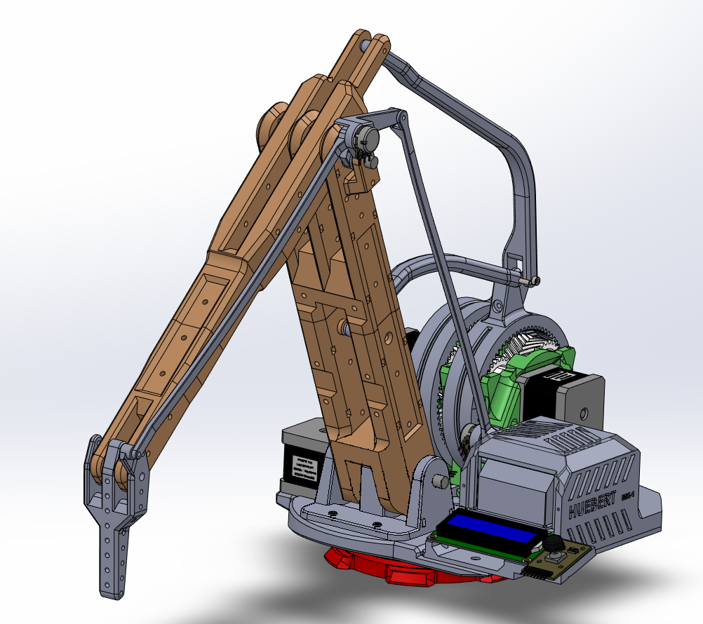

# HUEBERT_MK1
  
HUEBERT is a remote operate mechanical arm consisting of a main arm (HUE) and a controller arm (BERT).

The system operate over a network and serial connections. 2 PC connect via socket. Each PC is connected to either the HUE or BERT arduino controller via USB.

All requirements, design documentation, and implementation can be found in the documents folder of this repository.

## Alternate MATLAB Control
HUE Can be controlled via a MATLAB program using MATLAB's built in arduino package. A simple app is included in the matlab_src folder.

  